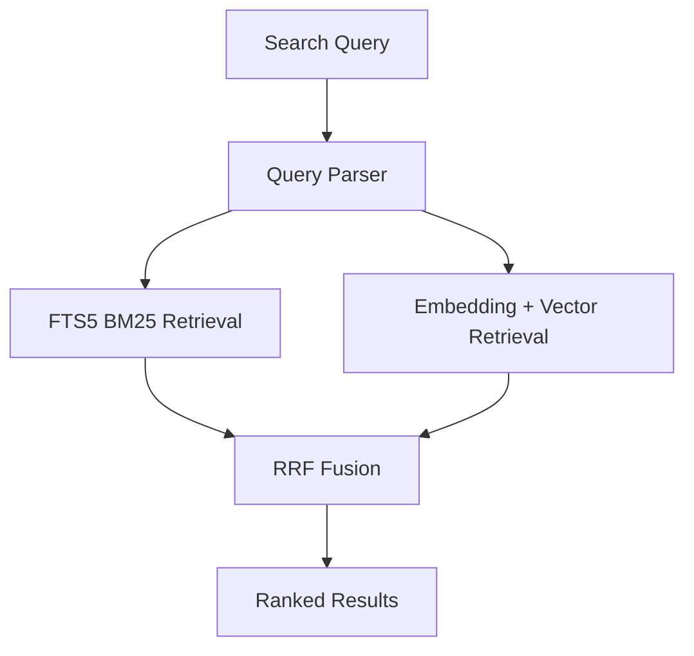

# Surf

Local-first, privacy-first hybrid search engine for the developer internet.

Search across Reddit, Telegram, Devpost, X data imports, and LinkedIn imports from one local interface using:

- SQLite
- FTS5 BM25 lexical search
- Local sentence-transformer embeddings
- Vector similarity storage in SQLite
- Reciprocal Rank Fusion (RRF)

No mandatory hosted LLM APIs. No hosted vector DB.

## Why This Exists

Technical opportunities and conversations are fragmented across communities.
Surf gives you a portable local index so you can search people, jobs, hackathons, projects, and discussions from one place.

## Architecture



## Hybrid Search Explanation

- BM25 is strong for exact keyword and phrase matching.
- Embeddings are strong for concept similarity.
- RRF combines both rankings safely without averaging incomparable score scales.

RRF formula:

$$
RRF(d) = \sum_i \frac{1}{k + rank_i(d)}
$$

## Project Structure

- apps/api: FastAPI backend
- apps/web: Next.js + TypeScript + Tailwind frontend
- core: database, parser, retrieval, fusion, embeddings
- connectors: plugin connectors and normalization into Document
- ingestion: dedup and indexing pipeline
- scheduler: APScheduler jobs
- config: YAML config
- tests: unit and integration-style tests
- data: local SQLite database

## Supported Sources (MVP)

- Reddit connector (API-style integration path)
- Telegram connector (incremental-sync oriented path)
- Devpost connector (hackathon and project discovery)
- X connector abstraction (import/API-safe path)
- LinkedIn import connector (no bypass scraping)

## Installation

### Backend

```bash
uv sync
```

### Frontend

```bash
cd apps/web
npm install
```

## Configuration

Main config file: `config/config.yaml`

```yaml
database:
  path: ./data/search.db

embeddings:
  model: sentence-transformers/all-MiniLM-L6-v2
  dimension: 384

search:
  bm25_limit: 50
  vector_limit: 50
  rrf_k: 60

connectors:
  reddit:
    enabled: true
    interval_minutes: 30

  telegram:
    enabled: true

  devpost:
    enabled: true
    interval_minutes: 1440

  x:
    enabled: false

  linkedin:
    enabled: false
```

## Running Locally

1. Start API

```bash
uv run uvicorn apps.api.main:app --reload --port 8000
```

2. Initialize database

```bash
uv run surf init
```

3. Index data

```bash
uv run surf index all
```

4. Search via CLI

```bash
uv run surf search "AI engineer Ethiopia"
uv run surf search "machine learning internship" --platform reddit
```

5. Start web UI

```bash
cd apps/web
npm run dev
```

Then open: http://localhost:3000

## API

- GET `/health`
- GET `/api/search?q=<query>`
- POST `/api/index/{connector_name}` where connector_name is one of `all`, `reddit`, `telegram`, `devpost`, `x`, `linkedin`
- GET `/api/stats`

## CLI

- `surf search "AI engineer Ethiopia"`
- `surf search "hackathon" --platform devpost`
- `surf index reddit`
- `surf index telegram`
- `surf index all`
- `surf stats`

## Adding Connectors

Implement `BaseConnector` in connectors and return normalized `Document` instances.
Do not add search logic to connectors.

Pipeline contract:

External Source -> Fetch -> Normalize -> Document -> Ingestion Pipeline

## Testing

```bash
uv run pytest -q
```

Current tests include:

- parser filters, phrase and exclusions
- RRF fusion
- dedup hash change behavior
- connector normalization shape checks
- lexical retrieval behavior

## Roadmap

- Real API clients for each connector with retries/rate-limit handling
- sqlite-vec native nearest-neighbor queries
- saved searches and alerts
- semantic alerting
- trend analytics
- richer importer workflows

## Contributing

Contributions are welcome.
Keep connector logic source-specific and keep core retrieval source-agnostic.

## License

MIT
